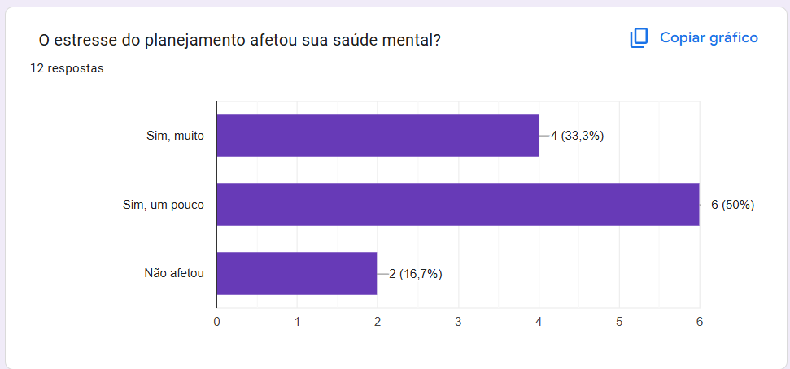
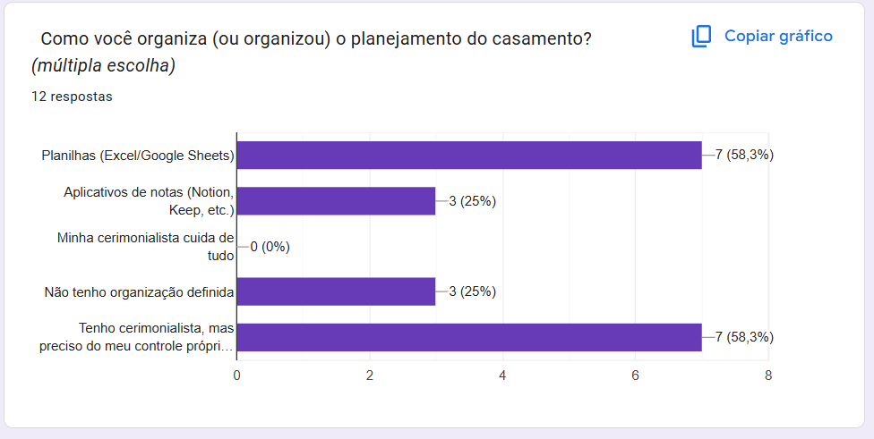
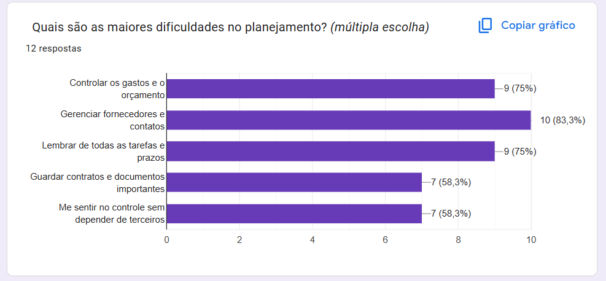
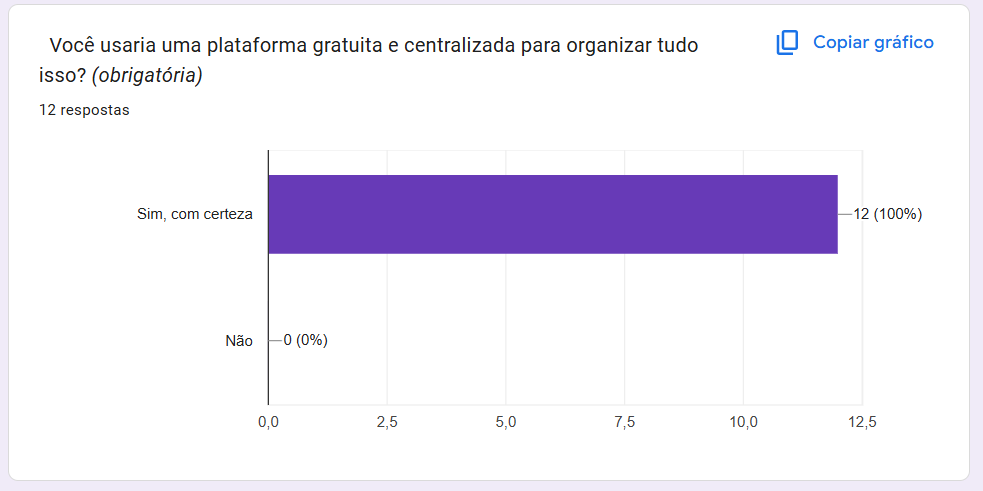
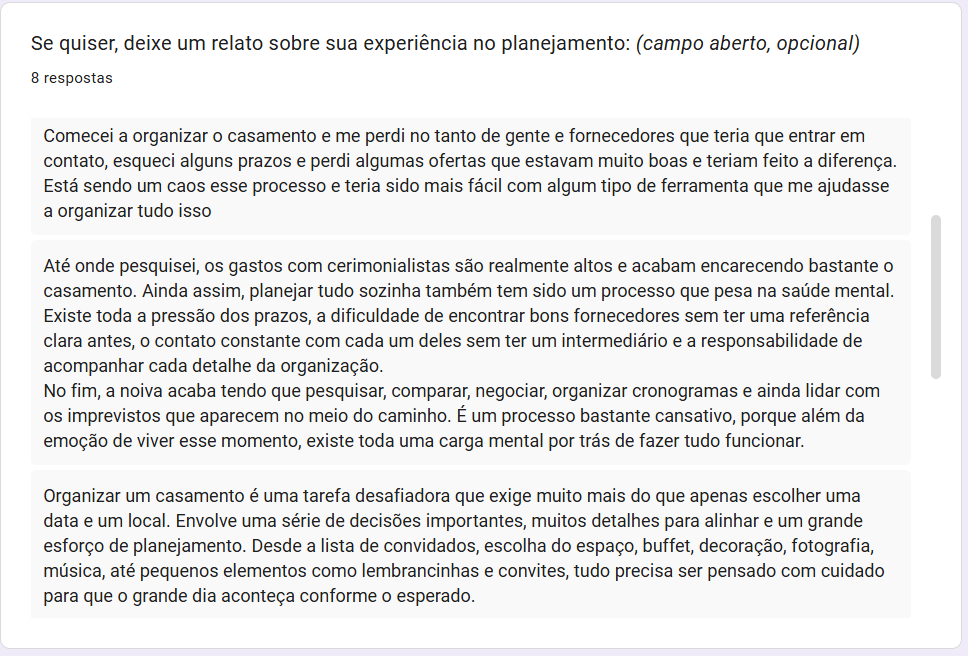
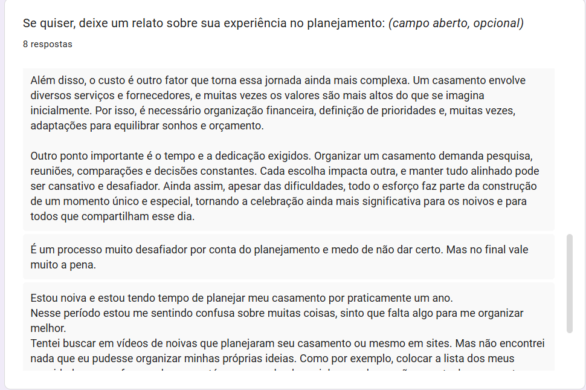
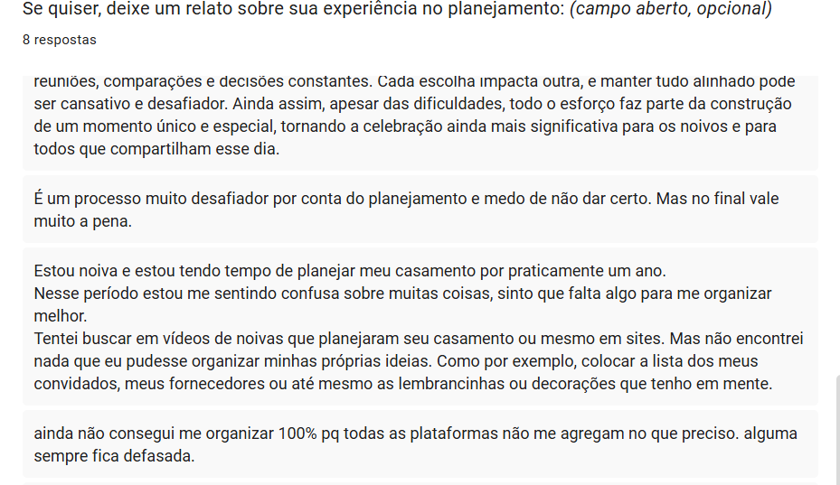
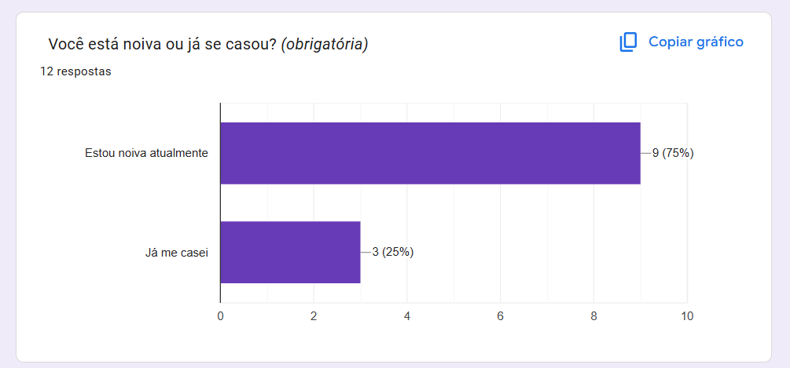
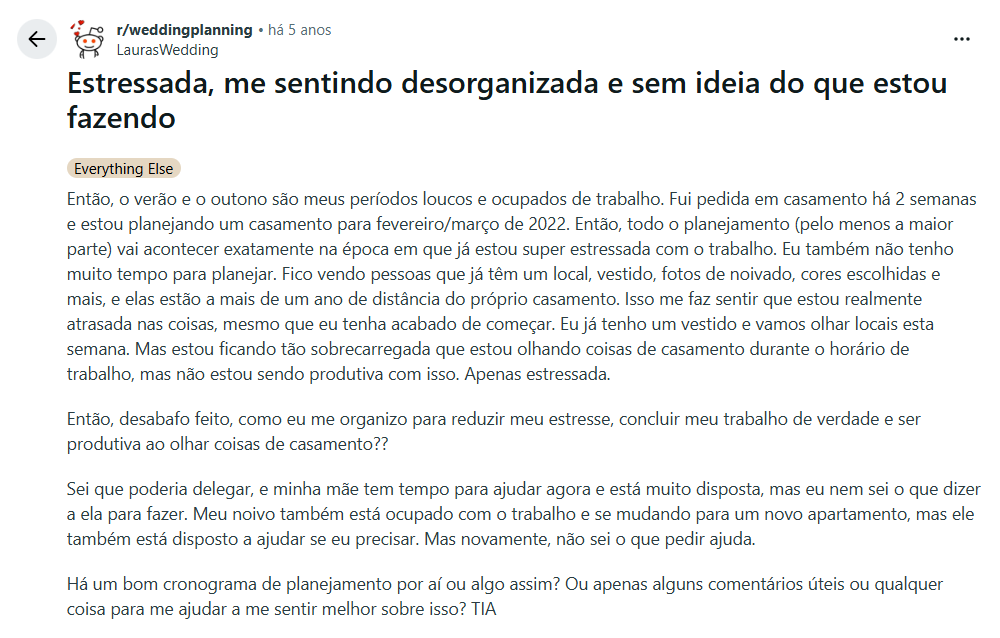

# RFC: Request for Comments — Projeto de Portfólio

**Engenharia de Software – Católica SC**

---

# Identificação

- **Título do Projeto:** BrideHub — Plataforma de Organização de Casamentos
- **Linha de Projeto (Direction):** Web App - Gestão
- **Autor:** Laíza Carolina da Silva
- **Data da Proposta:** _12/04/2026_
- **Versão:** 1.0

---

# 1. Visão do Produto e Impacto (O Problema)

## 1.1 Contexto e Problema

Planejar um casamento é um processo complexo, longo e emocionalmente intenso. Durante esse período, as noivas precisam gerenciar simultaneamente dezenas de fornecedores, controlar um orçamento detalhado, acompanhar tarefas com prazos distintos, guardar contratos e documentos, e ainda manter o controle de tudo isso sem perder nenhum detalhe.

Hoje, a grande maioria das noivas realiza esse processo de forma fragmentada: utilizam planilhas do Excel ou Google Sheets para controle financeiro, aplicativos de notas para registrar tarefas, pastas no Google Drive para guardar contratos, e dependem fortemente da sua cerimonialista para se manter organizadas. Quando não há cerimonialista, a desorganização é ainda maior.

Esse cenário apresenta limitações claras:

- Informações espalhadas em múltiplas ferramentas sem integração
- Risco de perda de dados e contratos importantes
- Dependência de terceiros para manter a organização
- Dificuldade de visualizar o andamento geral do planejamento
- Ausência de uma solução gratuita, centralizada e voltada especificamente para esse processo

A autora deste projeto vivencia esse problema em primeira pessoa, sendo noiva e tendo passado pelas mesmas dificuldades descritas acima. Essa experiência real fundamenta a proposta e garante profundo conhecimento do domínio do problema.

---

## 1.2 Origem da Demanda e Evidências

### Experiência da Autora

A proposta do BrideHub nasceu da experiência pessoal da própria autora, que ao iniciar o planejamento do seu casamento identificou a ausência de uma ferramenta gratuita, centralizada e focada especificamente na organização do processo.

### Comunidade de Noivas

A autora faz parte de uma comunidade ativa de noivas, já formada e engajada, que foi utilizada como fonte primária de validação da demanda. As dores relatadas pelas participantes dessa comunidade confirmam o problema descrito: dependência de planilhas, falta de organização centralizada e ausência de ferramentas gratuitas adequadas. Os feedbacks foram colhidos através de um formulário (Google Forms) encaminhado para noivas e recém casadas.

Além disso, há também evidências em todo lugar. Utilizando o Reddit, observamos que os relatos identificados datam de até 5 anos atrás, evidenciando que o problema não é novo e que, mesmo com o tempo, nenhuma solução gratuita e centralizada surgiu para resolvê-lo de forma satisfatória.

---

## 1.3 Análise de Soluções Existentes (Benchmark)

Foram analisadas as principais soluções disponíveis no mercado que buscam resolver problemas semelhantes:

| Solução | Público-Alvo | Pontos Fortes | Limitações |
|--------|-------------|--------------|-----------|
| [WedFlow](https://wed-flow.com) | Noivas e cerimonialistas | Organização de fornecedores, gestão de tarefas | Pago, voltado a cerimonialistas, não gratuito |
| [Zankyou](https://www.zankyou.com.br) | Noivas | Site do casamento, lista de presentes | Foco em marketing/divulgação, não em organização interna |
| Google Sheets / Excel | Usuários em geral | Gratuito, flexível | Não específico para casamentos, sem integração, manual |
| Notion | Usuários em geral | Flexível, personalizável | Requer configuração manual, curva de aprendizado, não focado em casamentos |

### Diferencial do Projeto

O BrideHub se diferencia das soluções existentes por ser:

- **Gratuito** — sem planos pagos ou funcionalidades bloqueadas
- **Focado exclusivamente na noiva** — e não na cerimonialista ou no fornecedor
- **Centralizado** — reúne fornecedores, orçamento, tarefas e documentos em um único lugar
- **Em português** — desenvolvido para o contexto brasileiro
- **Simples e objetivo** — sem a complexidade de plataformas genéricas como Notion ou planilhas

---

## 1.4 Público-Alvo

O BrideHub é destinado a **noivas** em processo de planejamento do casamento, independentemente do tamanho ou estilo do evento.

**Perfil do usuário:**
- Mulheres entre 18 e 50 anos
- Em fase de noivado ou planejamento ativo do casamento
- Com acesso a dispositivos com navegador web (desktop ou mobile)
- Nível técnico básico a intermediário — não é necessário conhecimento em tecnologia
- Podem ou não ter cerimonialista contratada
- Buscam independência e controle sobre o próprio planejamento

**Contexto de uso:**
- Uso frequente ao longo de meses (o planejamento de um casamento dura em média 12 a 18 meses)
- Acesso em diferentes momentos do dia, em casa, no trabalho ou em reuniões com fornecedores
- Necessidade de acesso rápido a informações como contatos de fornecedores e status de pagamentos

---

## 1.5 Objetivos do Projeto

### Objetivo Geral

Desenvolver uma aplicação web gratuita que centralize e simplifique o planejamento do casamento, oferecendo às noivas autonomia e organização durante todo o processo, sem depender de planilhas ou cerimonialistas para manter o controle.

### Objetivos Específicos

1. Implementar um módulo de **gerenciamento de fornecedores**, permitindo cadastro, categorização, controle de status e registro de contatos
2. Implementar um módulo de **controle de orçamento nupcial**, com visão geral de gastos, parcelas e pagamentos realizados
3. Implementar um módulo de **tarefas e checklist**, com prazos, prioridades e acompanhamento de progresso
4. Implementar um módulo de **documentos e contratos**, permitindo upload e organização de arquivos importantes
5. Validar a solução com usuárias reais da comunidade de noivas, coletando feedback formal ao longo do desenvolvimento

---

## 1.6 Métricas de Sucesso (KPIs)

- Tempo de resposta das principais rotas da API inferior a **300ms**
- Cobertura de testes unitários de **75% no backend** e **25% no frontend**
- Aprovação da solução por pelo menos **5 noivas da comunidade** ao final do projeto, mediante feedback documentado
- Sistema disponível em ambiente produtivo com **uptime mínimo de 99%** durante o período de avaliação
- Ao menos **3 fluxos de negócio completos** funcionando em ambiente de produção até o Demo Day

---
